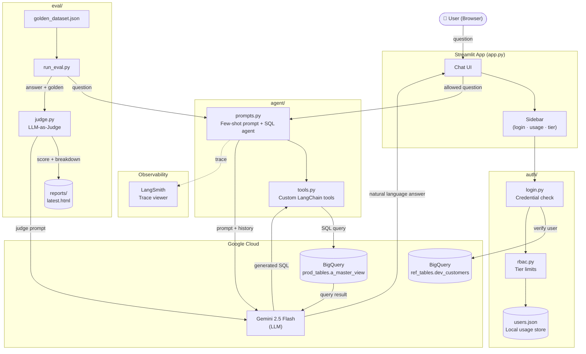

# Demography Insights — Suburb Finder AI

A Streamlit-based SaaS app that lets authenticated users query Australian demographic data using natural language. Questions are answered by a LangChain SQL agent backed by Google Gemini and Google BigQuery.

---

## Project Structure

```
demography-insights/
├── app.py                    # Main Streamlit entry point
│
├── agent/
│   ├── bigquery_client.py    # Authenticated BigQuery client for agent queries
│   ├── explore_data.py       # Data exploration utilities
│   ├── prompts.py            # Few-shot prompt prefix + LangChain SQL agent setup
│   ├── sql_agent.py          # (reserved)
│   └── tools.py              # Custom LangChain tools
│
├── auth/
│   ├── bigquery_auth.py      # Verifies users against BigQuery customer table
│   ├── login.py              # Streamlit sidebar login UI
│   ├── rbac.py               # Tier-based query limits (free / basic / pr)
│   └── users.py              # Local usage tracking (read/write users.json)
│
├── db/
│   └── bigquery_client.py    # Shared BigQuery client for auth queries
│
├── chat_history/             # Per-user conversation history (JSON files)
│
├── eval/
│   ├── golden_dataset.json   # Ground-truth Q&A pairs (10 integration + 8 unit test cases)
│   ├── judge.py              # LLM-as-judge: scores answers via Gemini on a 1–5 rubric
│   ├── run_eval.py           # Eval runner + pytest unit tests
│   └── reports/              # Generated HTML + JSON reports (latest.html always up to date)
│
├── .streamlit/
│   └── config.toml           # Streamlit theme and server config
│
├── users.json                # Runtime usage store (created automatically)
├── .env                      # Environment variables — not committed
├── service_account.json      # GCP service account key — not committed
└── requirements.txt          # Python dependencies
```

---

## Architecture



---

## Tech Stack

| Layer | Technology |
|---|---|
| Frontend / UI | [Streamlit](https://streamlit.io) |
| LLM | Google Gemini (`gemini-2.5-flash-lite`) via `langchain-google-genai` |
| Agent framework | [LangChain](https://www.langchain.com) SQL agent |
| Data warehouse | [Google BigQuery](https://cloud.google.com/bigquery) |
| BQ connector | `sqlalchemy-bigquery` + `google-cloud-bigquery` |
| Auth backend | BigQuery (`demografy.ref_tables.dev_customers`) |
| Observability | [LangSmith](https://smith.langchain.com) tracing |
| Env management | `python-dotenv` |

**Data source:** `demografy.prod_tables.a_master_view` — Australian suburb-level KPIs including prosperity, diversity, education, rental access, social housing, and more.

---

## How Authentication & Tiers Work

1. Users log in with a **User ID + email** pair that is verified against BigQuery.
2. Each user is assigned a **tier** (`free`, `basic`, or `pr`) stored in BigQuery.
3. Question limits per tier are configured via environment variables:
   - `free` — 3 questions per 24 hours
   - `basic` — 20 questions per 24 hours
   - `pr` — 50 questions per 24 hours (`-1` = unlimited)
4. Usage is tracked locally in `users.json` and resets **24 hours after the last login**.
5. A warning banner appears when the user has consumed 80 %+ of their limit.

---

## Setup

### Prerequisites

- Python 3.11+
- A Google Cloud project with BigQuery enabled
- A GCP service account with BigQuery read access
- A Gemini API key
- A LangSmith API key (optional, for tracing)

### 1. Clone and install dependencies

```bash
git clone <repo-url>
cd demography-insights
pip install -r requirements.txt
```

### 2. Configure environment variables

Create a `.env` file in the project root:

```env
GOOGLE_APPLICATION_CREDENTIALS=./service_account.json
GEMINI_API_KEY=your_gemini_api_key
BIGQUERY_PROJECT=your_gcp_project_id

# LangSmith tracing (optional)
LANGCHAIN_TRACING_V2=true
LANGCHAIN_API_KEY=your_langsmith_api_key
LANGCHAIN_PROJECT=your_project_name

# Tier question limits (-1 = unlimited)
FREE_TIER_LIMIT=5
BASIC_TIER_LIMIT=20
PR_TIER_LIMIT=50
```

### 3. Add the GCP service account key

Place your service account JSON file at the path referenced by `GOOGLE_APPLICATION_CREDENTIALS` (default: `./service_account.json`). This file is gitignored — do not commit it.

### 4. Run the app

```bash
streamlit run app.py
```

The app will be available at `http://localhost:8501`.

---

## Evaluation Suite

### Purpose

The eval suite measures the quality of the LangChain SQL agent's natural-language answers against a curated set of known-correct responses. It catches regressions when the prompt, schema, or model changes, and provides a scored HTML report after every run.

It uses an **LLM-as-Judge** pattern: a separate Gemini model reads the agent's answer alongside the expected golden answer and scores it on a 1–5 rubric, then writes a full breakdown of relevance, groundedness, and completeness.

---

### Scoring Rubric

| Score | Label | Meaning |
|---|---|---|
| 5 | PERFECT | Exact match with correct data |
| 4 | GOOD | Correct data, minor formatting differences |
| 3 | OK | Mostly correct, small discrepancies |
| 2 | POOR | Partially correct, significant errors |
| 1 | FAIL | Wrong answer or failed to execute |

---

### Eval File Structure

```
eval/
├── golden_dataset.json   # Ground-truth Q&A pairs (integration + unit test cases)
├── judge.py              # LLM-as-judge: sends question + golden answer + actual answer to Gemini
├── run_eval.py           # Eval runner (also contains pytest unit tests)
└── reports/
    ├── latest.html       # Always overwritten — open this after every run
    ├── latest.json       # Machine-readable version of latest results
    ├── eval_report_<timestamp>.html   # Permanent history of each run
    └── eval_report_<timestamp>.json
```

#### `golden_dataset.json` — two types of entries

| Field | Present on | Purpose |
|---|---|---|
| `question` | all | The natural-language question asked |
| `golden_answer` | all | The correct reference answer (sourced from real DB output) |
| `simulated_answer` | unit test cases only | A pre-written answer fed to the judge — no agent call needed |
| `expected_score_range` | unit test cases only | `[min, max]` the judge score must fall within |
| `test_label` | unit test cases only | Human-readable description of what the test exercises |

---

### Commands

#### Full integration eval — calls the real agent + judge, generates HTML report

```bash
python -m eval.run_eval
```

This will:
1. Load the 10 base cases from `golden_dataset.json`
2. Run each question through the LangChain SQL agent
3. Send the agent's answer + golden answer to the judge LLM
4. Print a scored breakdown to the terminal
5. Write `eval/reports/latest.html` and a timestamped copy

Open the report:
```bash
open eval/reports/latest.html
```

#### Unit tests — judge only, no agent calls, runs in seconds

```bash
pytest eval/run_eval.py -v
```

These tests use the `simulated_answer` field from `golden_dataset.json` — they skip the SQL agent entirely and only exercise the judge. They assert that:
- High-quality simulated answers score **4 or 5**
- Low-quality simulated answers score **1 or 2**
- Partial simulated answers score **2–4**

This lets you verify the judge is calibrated correctly without making any BigQuery or agent calls.

---

### What the HTML Report Contains

- **Header** — average score, total questions, passed (≥ 4) and failed (≤ 2) counts
- **Score distribution** — colour-coded bar chart across all score bands
- **Per-question table** — question, agent answer preview, score badge, and full judge breakdown (relevance, groundedness, completeness, reasoning)

A timestamped JSON version is also saved alongside the HTML for programmatic use.